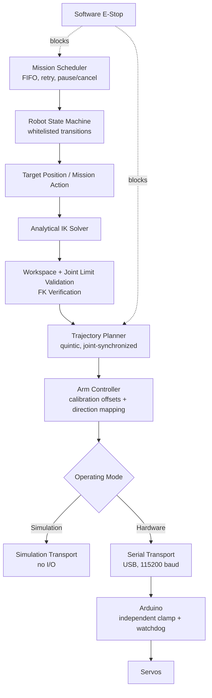

# ARMIS — Autonomous Robotic Manipulation and Intelligent Servo Control


## Authors

- **Aayush Mishra** — 4th Year, Mechatronics Engineering, MIT Manipal
- **Dr. Abhay Jangid** — Oncology Resident, KMC Manipal
- **Pranay Shet** (Co-Author) — 2nd Year, Electronics & Communication, MIT Manipal

## Overview

ARMIS is a 4-DOF robotic arm control stack: a Unity front end (analytical
IK, trajectory planning, mission orchestration, live telemetry) paired
with lightweight Arduino firmware (servo control, independent safety
clamping, comms watchdog). It runs a real 2-link planar arm on a rotating
base — base, shoulder, elbow, gripper — over USB serial.

Scope is intentionally narrow: no ROS2, no physics-simulation engine, no
reinforcement learning, no cloud dependency. Every feature either runs on
the current four-servo hardware, needs only an inexpensive addition (limit
switches, a distance sensor), or is explicitly simulation-only.

## Application Context — Oncology Robotics

This project is being developed with input from an oncology resident
(Dr. Abhay Jangid) toward manipulation tasks relevant to oncology lab and
clinical-support workflows — precise, repeatable positioning and
pick-and-place motion, and teach-and-repeat sequences that can be recorded
once and replayed reliably (e.g. specimen or sample handling, staged
positioning tasks). It is a **research and engineering platform, not a
medical device**: there is no sterilizable or biocompatible end-effector,
no clinical validation, and no regulatory clearance. It is not intended
for patient contact or any patient-facing use in its current form.

## Objectives

- Keep the existing analytical 2-link IK closed-form rather than
  switching to a numerical solver.
- Make IK accuracy objectively measurable (FK verification), not just
  visually plausible — relevant to any future precision-positioning claim.
- Enforce joint/workspace safety independently in Unity **and** Arduino —
  the firmware never trusts the host.
- Replace ad-hoc motion with a mathematically explainable, jointly
  synchronized trajectory generator.
- Support teach-and-repeat and mission-level pick-and-place on reusable
  primitives, not a hardcoded sequence.

## Key Features

| Feature | Summary |
|---|---|
| Analytical IK | Closed-form 2-link planar solve, numerically protected against NaN; returns valid/clamped angles + workspace/joint-limit status |
| FK Verification | Every IK solve is checked by forward kinematics; reports Euclidean position error as an objective accuracy number |
| Workspace & Joint Safety | Independent limits enforced in both Unity and Arduino — neither layer trusts the other |
| Trajectory Planning | Quintic smootherstep interpolation; all four joints synchronized by construction, not tuning |
| Teach-and-Repeat | Record, save/load (JSON), and play back waypoint sequences |
| Mission Scheduling | FIFO queue with pause/resume/cancel/retry-last-failed |
| Pick-and-Place | Reusable `Mission`/`MissionAction` abstraction; pick/place points set manually — no object detection |
| Telemetry | Live dashboard (connection, state, IK error, mission status); fully populated with no hardware attached |
| Serial Protocol | Human-readable `B<n>S<n>E<n>G<n>` packets, 115200 baud, ~20 Hz |
| Comms Watchdog | Arduino holds last position — never snaps to a default pose — if commands stop arriving |
| Homing | Configurable software home pose, reachable by command or mission action |
| Emergency Stop | Software-only: cancels motion, forces `FAULT`, requires explicit reset (see Safety) |

## Architecture



## Hardware

| Component | Notes |
|---|---|
| Controller | Arduino-compatible microcontroller (Uno/Nano-class) |
| Servos | 4× hobby servo, user-configurable |
| Gripper | Simple open/close servo gripper |
| Power | External servo power rail (not the Arduino 5V pin) |
| Communication | USB serial, 115200 baud |
| Optional sensors | Limit switches, E-stop input, gripper feedback, object-present sensor — interfaces exist, not required |

## Software Stack

- Unity 2021.3 LTS+ / C# — no packages beyond built-in `UnityEngine.UI`
- Arduino IDE (or PlatformIO) / C++ — `Servo.h` only, no third-party libs

## Repository Structure

```
Assets/
  Scripts/
    IK/
      IKManager.cs
      ForwardKinematics.cs
    Motion/
      TrajectoryPlanner.cs
      Waypoint.cs
    Robot/
      RobotConfiguration.cs
      RobotCommand.cs
      RobotStateMachine.cs
      RobotOrchestrator.cs
    Missions/
      Mission.cs
      MissionAction.cs
      MissionScheduler.cs
    Hardware/
      ArmController.cs
      IRobotTransport.cs
      SimulationRobotTransport.cs
      SerialRobotTransport.cs
    UI/
      RobotDashboard.cs
    Safety/
      SafetyManager.cs
    Debugging/
      ARMISManualTestHarness.cs
Arduino/
  ARMIS_Controller/
    ARMIS_Controller.ino
README.md
LICENSE
```

## Quick Start

**Unity (simulation, no hardware needed):**
1. Create a Unity 2021.3+ project, copy `Assets/Scripts/` in, confirm a
   clean compile.
2. `Create > ARMIS > Robot Configuration` for a `RobotConfiguration` asset.
3. Add `IKManager`, `TrajectoryPlanner`, `RobotStateMachine`,
   `MissionScheduler`, `ArmController`, `SafetyManager`,
   `RobotOrchestrator` to one GameObject; wire their references and the
   shared `RobotConfiguration` in the Inspector.
4. On `ArmController`, leave `mode = Simulation`. Press Play.

**Arduino (hardware mode, after simulation checks out):**
1. Wire servos to pins **Base=6, Shoulder=9, Elbow=10, Gripper=11**, on
   external servo power with a shared ground.
2. Upload `ARMIS_Controller.ino`; set `JOINT_MIN[]`/`JOINT_MAX[]` to your
   servos' safe range, mirrored in `RobotConfiguration`.
3. Set `serialPortName`/`baudRate` (115200) in Unity, switch
   `ArmController.mode = Hardware`, and calibrate per-joint offsets and
   direction (`Normal`/`Reversed`) until physical pose matches logical
   pose.
4. First power-on: unpowered servos → simulation check → power on with no
   commands sent → single slow `Move Home` → only then test other moves.

## Safety

- **Joint & workspace limits** — enforced in Unity before transmission.
- **Arduino-side validation** — every parsed packet is independently
  clamped to the firmware's own limit table, regardless of what Unity sent.
- **Comms watchdog** — Arduino holds last position (not an arbitrary
  pose) if valid packets stop arriving within a configurable timeout.
- **Software E-stop** — cancels trajectory/mission, forces `FAULT`,
  requires explicit reset. This is a software safeguard only — it cannot
  cut servo power and cannot substitute for a hardware E-stop circuit.
  Any deployment near people should add one.

## Limitations

- Open-loop control — no encoder feedback, no closed-loop correction.
- No guaranteed physical collision avoidance; Unity's visual sim is not a
  safety guarantee.
- Position accuracy is bounded by servo/calibration quality, not by the
  IK math (FK verification checks the model, not the real world).
- No clinical validation, sterilization, or biocompatibility — not
  approved or intended for patient contact.

## Future Work

- Closed-loop feedback via joint encoders and force/torque sensing
- Camera-based object localization
- Sterilizable/biocompatible end-effector design, if pursued toward
  clinical-adjacent use
- Formal specification of oncology-workflow task requirements in
  collaboration with clinical input, and any validation that would
  require before use near a patient or a real specimen

## License

MIT
